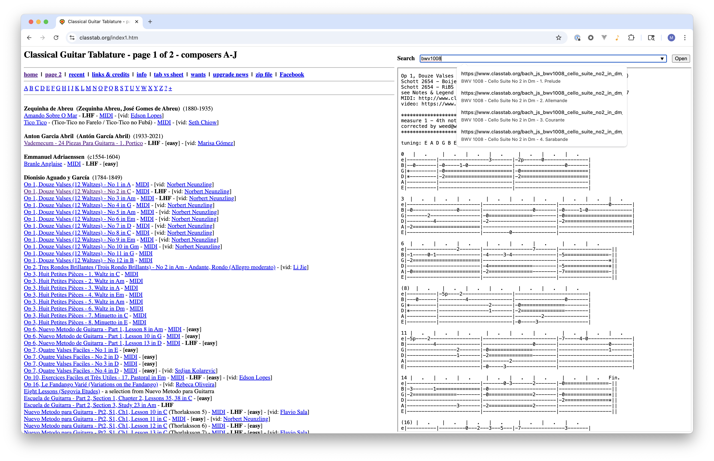

# Classtab Navigator

[Install Chrome
Extension](https://chromewebstore.google.com/detail/classtab-navigator/hgfhelajcmhdicdinikicoionaggpkkc?authuser=0&hl=en&pli=1)

## About

This is a browser extension for [classtab.org](https://classtab.org/). It makes
surfacing the tabs you want a bit easier and faster.

## Manual installation

### Chrome browser

1. Clone this repo
1. Visit `chrome://extensions` in a tab and click **Load unpacked**
1. Choose this the folder for this repo
1. Visit [classtab.org](https://classtab.org/)

### Safari browser

1. Clone this repo
1. Go to **Safari > Settings… > Developer** and enable "Allow unsigned
   extensions".
1. Then click **Add Temporary Extension…** >
1. Choose this the folder for this repo
1. Visit [classtab.org](https://classtab.org/)

## Contributing

Maybe create an **Issue** and then Fork the repo and Open a Pull Request and
satisfies what you described in the Issue.

## Credits

Icon created by Rica Hollmann from Noun Project.
